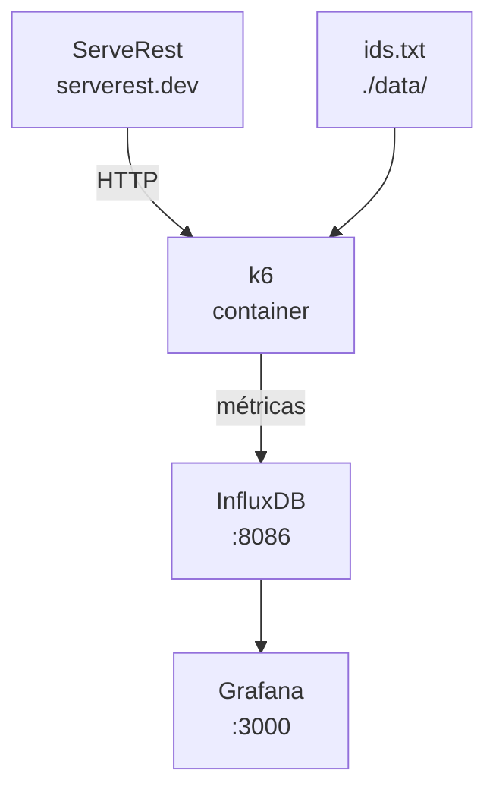

# Teste de Performance com k6 — ServeRest

Projeto de testes de performance utilizando **k6** para realizar requisições na API do ServeRest.

O projeto utiliza a lista de usuários disponibilizada pela API, extrai seus IDs e permite executar diferentes estratégias de acesso:

- Percorrer os IDs do primeiro ao último.
- Percorrer os IDs do último ao primeiro.
- Acessar IDs de forma aleatória.
- Executar os testes utilizando `check` e configurações de `options` do k6.

## Estrutura do projeto

```
.
├── ids.txt
├── buscar_ids.sh
├── teste-inicio-fim.js
├── teste-fim-inicio.js
├── teste-aleatorio.js
└── README.md
```

> Os nomes dos arquivos `.js` são apenas uma sugestão. Você pode alterá-los conforme a organização do projeto.

## Pré-requisitos

É necessário ter instalado:

- k6
- `curl`
- `jq`

### Verificar instalação

```
k6 version
curl --version
jq --version
```

## 1\. Gerando o arquivo de IDs

O script `buscar_ids.sh` consulta a API de usuários do ServeRest e salva os IDs em um arquivo chamado `ids.txt`.

```
#!/bin/bash

URL="https://serverest.dev/usuarios"
ARQUIVO="ids.txt"

curl -s "$URL" | jq -r '.usuarios[]["_id"]' > "$ARQUIVO"

echo "IDs salvos em $ARQUIVO"
```

Dê permissão de execução:

```
chmod +x buscar_ids.sh
```

Execute:

```
./buscar_ids.sh
```

Depois disso, o arquivo `ids.txt` terá um ID por linha:

```
0uxuPY0cbmQhpEz1
tXjGJ8b5w...
...
```

## 2\. Teste do primeiro ID até o último

Neste cenário, o k6 percorre o arquivo na ordem em que os IDs estão armazenados.

```
import http from 'k6/http';
import { check } from 'k6';

const BASE_URL = 'https://serverest.dev';
const IDS_FILE = '../data/ids.txt';

const ids = open(IDS_FILE)
  .split('\n')
  .map(id => id.trim())
  .filter(id => id.length > 0);

export const options = {
  vus: 1,
  iterations: ids.length,
};

export default function () {
  const id = ids[__ITER];

  const response = http.get(`${BASE_URL}/usuarios/${id}`);

  check(response, {
    'status é 200': r => r.status === 200,
    'resposta possui conteúdo': r => r.body && r.body.length > 0,
  });
}
```

Execução:

```
k6 run teste-inicio-fim.js
```

A sequência será:

```
ID 001
  ↓
ID 002
  ↓
ID 003
  ↓
...
ID N
```

## 3\. Teste do último ID até o primeiro

Para inverter a ordem dos IDs, utilizamos `reverse()`.

```
import http from 'k6/http';
import { check } from 'k6';

const BASE_URL = 'https://serverest.dev';
const IDS_FILE = '../data/ids.txt';

const ids = open(IDS_FILE)
  .split('\n')
  .map(id => id.trim())
  .filter(id => id.length > 0)
  .reverse();

export const options = {
  vus: 1,
  iterations: ids.length,
};

export default function () {
  const id = ids[__ITER];

  const response = http.get(`${BASE_URL}/usuarios/${id}`);

  check(response, {
    'status é 200': r => r.status === 200,
    'resposta possui conteúdo': r => r.body && r.body.length > 0,
  });
}
```

Execução:

```
k6 run teste-fim-inicio.js
```

Se o arquivo tiver:

```
ID-001
ID-002
ID-003
ID-004
ID-005
```

A execução será:

```
ID-005
  ↓
ID-004
  ↓
ID-003
  ↓
ID-002
  ↓
ID-001
```

## 4\. Teste com IDs aleatórios

Para simular um comportamento menos previsível, podemos selecionar um ID aleatório a cada iteração.

```
import http from 'k6/http';
import { check } from 'k6';

const BASE_URL = 'https://serverest.dev';
const IDS_FILE = '../data/ids.txt';

const ids = open(IDS_FILE)
  .split('\n')
  .map(id => id.trim())
  .filter(id => id.length > 0);

export const options = {
  vus: 1,
  iterations: 100,
};

export default function () {
  const id = ids[Math.floor(Math.random() * ids.length)];

  const response = http.get(`${BASE_URL}/usuarios/${id}`);

  check(response, {
    'status é 200': r => r.status === 200,
    'resposta possui conteúdo': r => r.body && r.body.length > 0,
  });
}
```

 Execute:

```
k6 run teste-aleatorio.js
```

Nesse cenário, os IDs podem ser repetidos:

```
ID-003
ID-001
ID-005
ID-002
ID-002
ID-004
ID-001
...
```

Isso permite executar uma quantidade de requisições maior que a quantidade de usuários existente.

 ## 5\. Entendendo o `options`

 A configuração:

```
export const options = {
  vus: 1,
  iterations: ids.length,
};
```

significa:

- `vus: 1` — utiliza um único Virtual User.
- `iterations: ids.length` — executa uma it

## `docker-compose` com **k6 + InfluxDB + Grafana**.

Sim. Para sua estrutura atual, eu sugiro deixar o `docker-compose.yml` na raiz e usar o k6 em um container separado. O k6 envia as métricas para o InfluxDB, e o Grafana consulta o InfluxDB.

### `docker-compose.yml`

docker-compose.yml

```
services:

  influxdb:
    image: influxdb:1.8
    container_name: k6-influxdb
    restart: unless-stopped
    ports:
      - "8086:8086"
    environment:
      INFLUXDB_DB: k6
      INFLUXDB_HTTP_AUTH_ENABLED: "false"
    volumes:
      - influxdb_data:/var/lib/influxdb

  grafana:
    image: grafana/grafana:latest
    container_name: k6-grafana
    restart: unless-stopped
    ports:
      - "3000:3000"
    depends_on:
      - influxdb
    environment:
      GF_SECURITY_ADMIN_USER: admin
      GF_SECURITY_ADMIN_PASSWORD: admin
      GF_USERS_ALLOW_SIGN_UP: "false"
    volumes:
      - grafana_data:/var/lib/grafana

  k6:
    image: grafana/k6:latest
    container_name: k6-runner
    depends_on:
      - influxdb
    volumes:
      - ./scripts:/scripts
      - ./data:/data
    working_dir: /scripts
    entrypoint: ["k6"]

volumes:
  influxdb_data:
  grafana_data:
```

 Sua estrutura ficará:

```
k6-serverest/
├── README.md
├── docker-compose.yml
├── buscar_ids.sh
├── data/
│   └── ids.txt
└── scripts/
    ├── shuffle.js
    ├── teste-aleatorio.js
    ├── teste-fim-inicio.js
    └── teste-inicio-fim.js
```

## Ajuste importante nos scripts

Como o container monta:

```
- ./data:/data
- ./scripts:/scripts
```

não precisamos mais depender de `../data/ids.txt`.

Dentro do container, o arquivo estará em:

```
/data/ids.txt
```

Então recomendo alterar:

```
const IDS_FILE = '../data/ids.txt';
```

para:

```
const IDS_FILE = '/data/ids.txt';
```

Isso também torna o caminho independente do diretório de execução.

## Subindo InfluxDB + Grafana

Na raiz do projeto:

```
docker compose up -d influxdb grafana
```

Verifique:

```
docker compose ps
```

Você deverá ter:

```
NAME            STATUS
k6-influxdb     Up
k6-grafana      Up
```

O Grafana estará disponível em:

```
http://localhost:3000
```

Login inicial:

```
Usuário: admin
Senha:   admin
```

## Executando o k6

Agora podemos executar o teste dentro do container:

```
docker compose run --rm k6 \
  run \
  --out influxdb=http://influxdb:8086/k6 \
  /scripts/teste-inicio-fim.js
```

O fluxo será:



 ## Configurando o Grafana

 Acesse:

```
http://localhost:3000
```

Depois vá em:

**Connections → Data sources → Add data source → InfluxDB**

Configure:

```
URL:
http://influxdb:8086

Database:
k6
```

Não precisa configurar usuário e senha porque desabilitamos a autenticação do InfluxDB neste ambiente.

Clique em **Save & test**.

Você deverá receber uma confirmação de conexão.

## Executando os outros cenários

### Início → fim

```
docker compose run --rm k6 \
  run \
  --out influxdb=http://influxdb:8086/k6 \
  /scripts/teste-inicio-fim.js
```

### Fim → início

```
docker compose run --rm k6 \
  run \
  --out influxdb=http://influxdb:8086/k6 \
  /scripts/teste-fim-inicio.js
```

### Aleatório

```
docker compose run --rm k6 \
  run \
  --out influxdb=http://influxdb:8086/k6 \
  /scripts/teste-aleatorio.js
```

## Uma melhoria que vale fazer agora

 Como você está montando um projeto de testes de performance, eu faria uma pequena evolução no Compose e adicionaria **Grafana provisionado automaticamente**, incluindo:

- Data source do InfluxDB criado automaticamente.
- Dashboard do k6 importado automaticamente.
- Configuração de thresholds.
- Variáveis para controlar `VUs`, duração e quantidade de iterações.
- Comandos `make up`, `make test`, `make test-random` e `make down`.

Assim você poderia simplesmente fazer:

```
docker compose up -d
```

e acessar o Grafana já com o dashboard do k6 pronto.